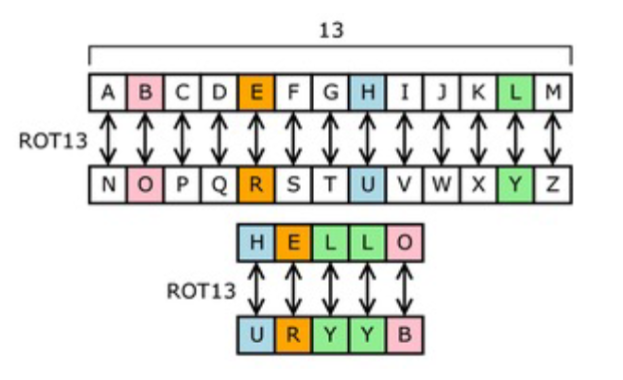
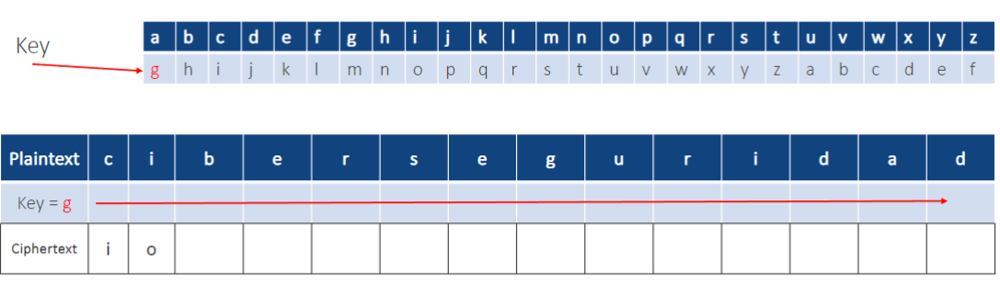
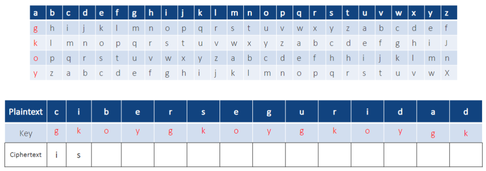
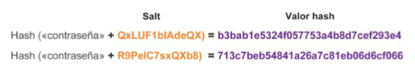

# Criptografía

## Criptología vs Criptografía

La __criptología__ es la ciencia de generar y descifrar códigos secretos.

La __criptografía__ es un método para almacenar y transmitir datos de modo que el receptor destinado pueda leerlos o procesarlos.

## Métodos para crear un texto cifrado

Cada método de encriptación utiliza una serie de pasos bien definidos utilizados para encriptar y descifrar los mensajes. Existen varios métodos para crear un texto cifrado:
1. Transposición 
2. Sustitución

## Transposición 

Mover las letras que tiene la palabra para generar otro string. Como con Voldemort.

## Sustitución

 

## Cifrado del César

 

## Cifrado de Vigenère

 

## Tipos de Encriptación

__Los algoritmos simétricos:__
- Utiliza una misma clave para cifrar y descifrar datos.
- El emisor y el receptor conocen la clave (pre compartida) antes de que comience cualquier comunicación cifrada.
- Cualquiera puede cifrar y descifrar el mensaje si conoce la clave secreta.

__Algoritmos asimétricos:__
- Usan una clave para cifrar los datos y una clave diferente para descifrarlos.
- Una clave es pública y la otra es privada.
- Cualquiera puede cifrar un mensaje con la clave pública del receptor, y el receptor es el único que puede descifrarlo mediante su clave privada.

## Algoritmos Simétricos 

- __3DES (DES triple)__: parte del cifrado de bloques simétrico (DES) con un tamaño de bloque de 64 bits que utiliza una
clave de 56 bits. El 3DES cifra los datos tres veces y utiliza una clave diferente para al menos una de las tres veces.
- __IDEA__: el algoritmo internacional de cifrado de datos (IDEA) utiliza bloques de 64 bits y claves de 128 bits. IDEA
realiza ocho rondas de las transformaciones en cada uno de los 16 bloques que se producen al dividir cada bloque
de 64 bits. IDEA fue el reemplazo de DES
- __AES__: el Estándar de encriptación avanzada (AES) tiene un tamaño de bloque fijo de 128 bits con un tamaño de
clave de 128, 192 o 256 bits. El NIST aprobó el algoritmo AES en 2001. El gobierno de los EE. UU. utiliza el AES para
proteger la información clasificada
- __Chacha20__: nivel de seguridad similar al AES pero más rápido. Sucesor de Salsa20. Ideal para procesos de alto
rendimiento

## Algoritmos Asimétricos 

- __RSA (Rivest-Shamir-Adleman)__: utiliza el producto de dos números primos muy grandes con una longitud
igual de entre 100 y 200 dígitos. Los navegadores utilizan RSA para establecer una conexión segura.
- __Diffie-Hellman__: proporciona un método de intercambio electrónico para compartir la clave secreta. Es
utilizado por protocolos como Secure Sockets Layer (SSL), Transport Layer Security (TLS) y Shell seguro (SSH).
- __ElGamal__: utiliza el estándar del gobierno de EE. UU. para las firmas digitales.
- __Criptografía de curva elíptica (ECC)__: usa curvas elípticas como parte del algoritmo. En EE. UU., la Agencia de
Seguridad Nacional utiliza la ECC para la generación de firma digital y el intercambio de claves.

## Simétricos vs Asimétricos

__Simétricos__:
- Son más eficientes con grandes volúmenes de datos.
- La administración de claves es más problemática
- No garantiza la autenticidad

__Asimétricos__:
- Son más eficientes en la protección de pequeñas cantidades de datos.
- Más segura en el intercambio de claves.
- Son más lentos que los simétricos.

## Algoritmos de Hash
El hash es una herramienta que garantiza la integridad de datos al tomar los datos binarios (el mensaje) y generar una representación de longitud fija llamada valor hash o síntesis del mensaje.

El hash es una función matemática unidireccional que es relativamente fácil de computar,, pero es mucho más difícil de revertir. Ej. Los granos de café molidos.

Una función de hash criptográfica tiene las siguientes propiedades:
- La entrada puede ser de cualquier longitud.
- La salida tiene una longitud fija
- La función de hash es unidireccional y es irreversible
- DOs valores de entrada distintos siempre darán como resultado distintos valores hash.

__Obsoletos/inseguros__:
- MD5
- SHA1

Propensos a colisiones y hay herramientas que pueden estimar el reverso

__Recomendados__:
- SHA2
- SHA3
- BLAKE2 (blockchain)

## Técnica de Salting

Un salt, que es una cadena aleatoria de caracteres, es una entrada adicional a la contraseña antes del hash.

Esto crea un resultado distinto de hash para las dos contraseñas como se muestra en la figura. Una base de datos almacena el hash y el salt.

 

## Enmascaramiento de datos

El enmascaramiento de datos es una tecnología que protege los datos al reemplazar la información confidencial por una versión no confidencial. La versión no confidencial se parece a la información original. Ejemplos:
- __Ofuscación de datos__: es el arte de hacer que el mensaje sea confuso, ambiguo o más difícil comprender.
- __Esteganografía__: oculta datos (el mensaje) en otro archivo, como un archivo de texto gráfico, de audio u otro archivo de texto.