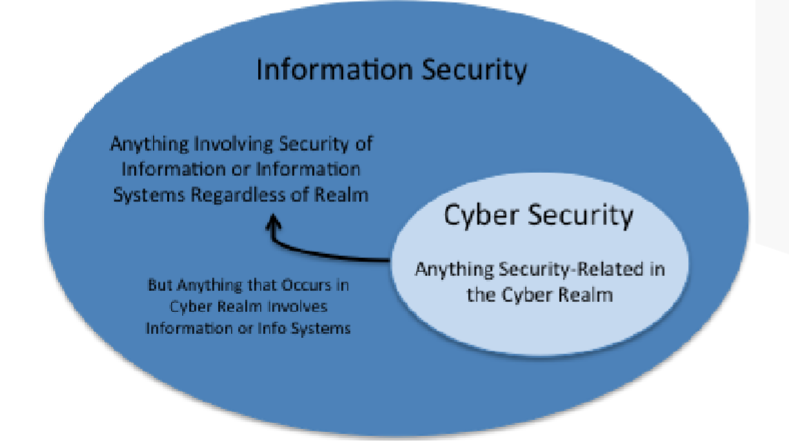
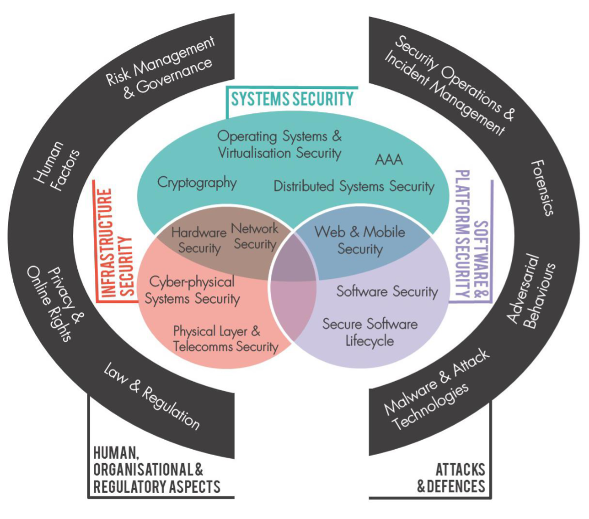
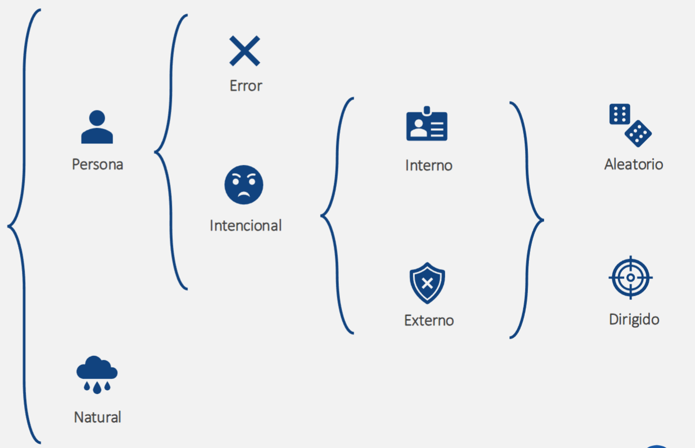
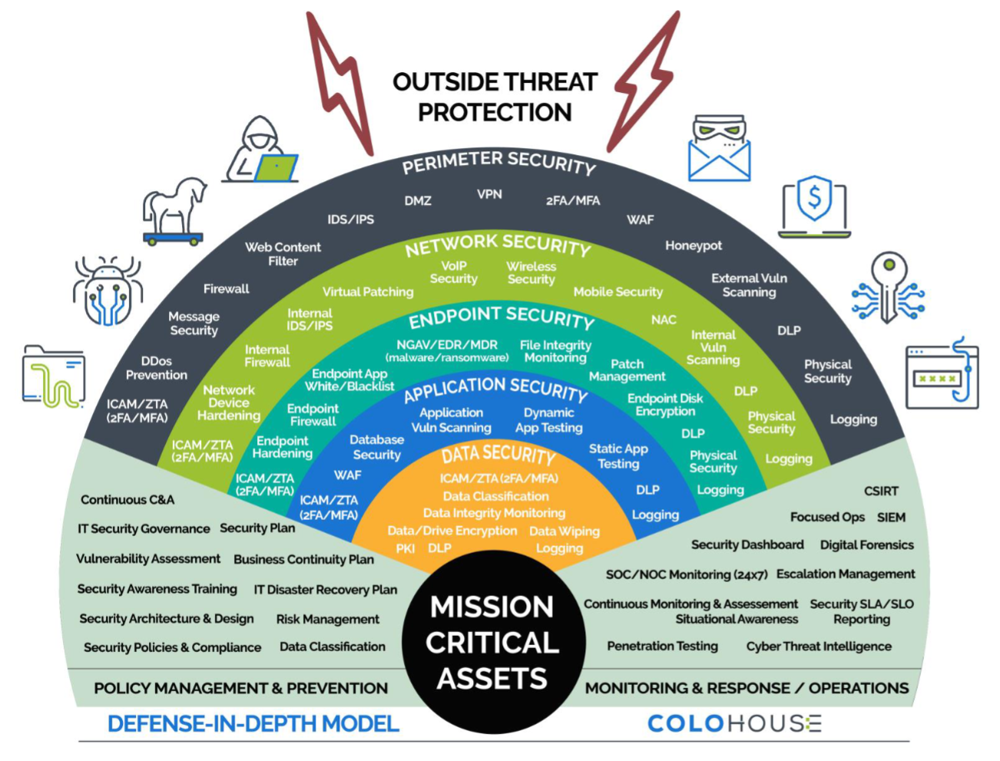
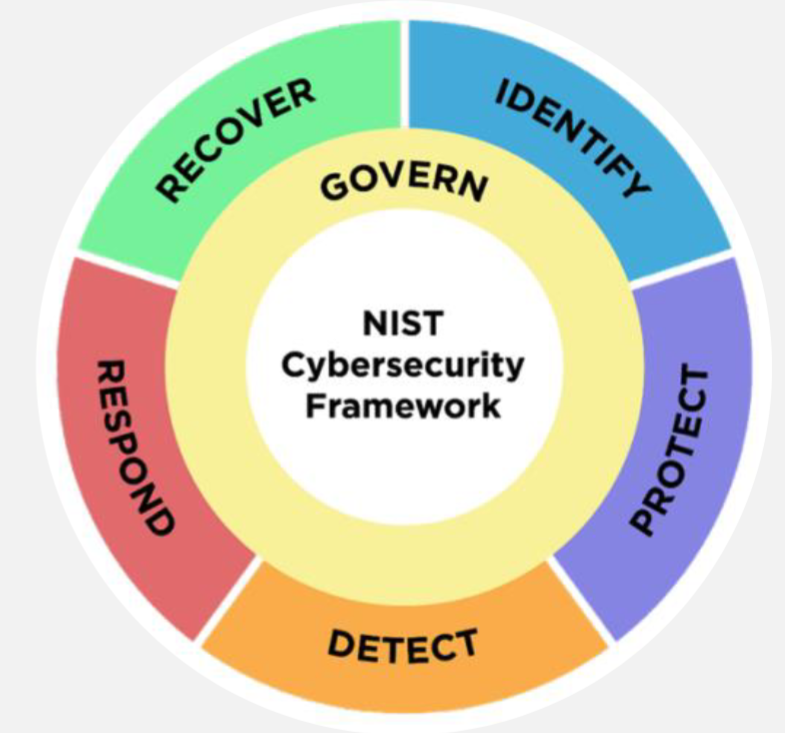

# Introducción a la Seguridad
## Activos de TI (IT Assets)
Cualquier elemento de tecnología de la información utilizado para agregar valor a la organización. Por ejemplo: Hardware, Software, información, ...

__Tangibles__:
- Servidores
- Ruteadores
- NAS
- Dispositivos IoT

__Intangibles__:
- Sistemas Operativos
- Aplicaciones
- Datos financieros de clientes
- Reputación

## CIA (Pilares de Seguridad)
- __Confidencialidad__: no autorización/autorización de accesos.
- __Integridad__: precisión y confiabilidad, cambios autorizados.
- __Disponibilidad__: acceso autorizado cuando se necesite.

### Actividad: ¿De qué pilar (CIA) se está afectando?
1. Un empleado descarga datos sensibles de clientes sin autorización. __Confidencialidad__
2. Un dispositivo de almacenamiento USB es robado y contiene datos sin cifrar.
3. Un ataque de ransomware encripta los archivos de una empresa, bloqueando el acceso. __Disponibilidad__
4. Un programador cambia el código de una aplicación para introducir una puerta trasera.
5. Un incendio en el centro de datos destruye servidores críticos sin respaldo. __Disponibilidad__
6. Acceder al campus sin credencial.

## Seguridad: Un Enfoque Holístico
"La ciberseguridad efectiva requiere una combinación de tecnología avanzada, procesos robustos y un personal debidamente capacitado." -SANS Institute

1. Personas
2. Procesos
3. Tecnología

Estos 3 elementos dan la protección de la CIA

## Seguridad de la Información vs. Ciberseguridad
"La ciberseguridad es una subdisciplina de la seguridad de la información, enfocada en proteger los sistemas y redes digitales." -ISACA

 

Protección de la información en cualquier formato. Ej. Digital o física

Protección del ámbito cibernético. Ej. Internet

## Áreas en Seguridad

 

 
## Actores de amenaza
Los actores de amenaza son entidads que pueden comprometer la seguridad de una organización.

 

## Vulnerabilidades
"Las vulnerabilidades son debilidades que pueden ser exlpotadas por actores de amenaza para comprometer un sistema o información." -OWASP

### Ejemplos de vulnerabilidades
- Errores en el código (inicialización de variables).
- Sistema operativo desactualizado.
- Configuración incorrecta en firewall (por default).
- Contraseña débil.

## Riesgos
Los riesgos son la probablidad de que se haya una penetración a las vulnerabilidades.

El riesgo se calcula como la probabilidad de que ocurra por el impacto que tenga si se penetra la vulnerabilidad.

3 cosas que se pueden hacer para lidiar con un riesgo son:
1. Aceptarlo, transferirlo, mitigarlo/reducirlo, evitarlo.
2. Identificación temprana.
3. Priorizar las medidas de seguridad.

## Controles
Acción, dispositivo, política, proceso, aparato o técnica que ayuda a reducir el riesgo, ya sea la probabilidad o el impacto.

Tipos de controles:
- __Detección__: IDS
- __Prevención__: Firewall
- __Mitigación__: Parches de seguridad
- __Recuperación__: Backup
- __Disuasión__: Cumplimiento normativo
- __Transferencia__: Seguros financieros

### Actividad: ¿Qué tipo de control es?
1. Outsourcing de Seguridad. __Transferencia__
2. Segmentación de red. __Prevención__ podría entrar en __Mitigación__
3. NACL. __Prevención__
4. SIEM. __Detección__
5. Política de contraseñas seguras. __Disuasión__
6. IPS. __Detección__
7. DRP. __Recuperación__
8. Logs de un sistema. __Detección__
9. Correción de configuración. __Mitigación__

## Modelo de Defensa en Profundidad

 

## Marcos de Referencia
- NIST (gestión de riesgos)
- ISO/IEC 27001 (seguridad de la información)
- CIS Controls (controles técnicos)

Sector específico:
- PCI-DSS (financiero)
- HIPAA (salud)

 

