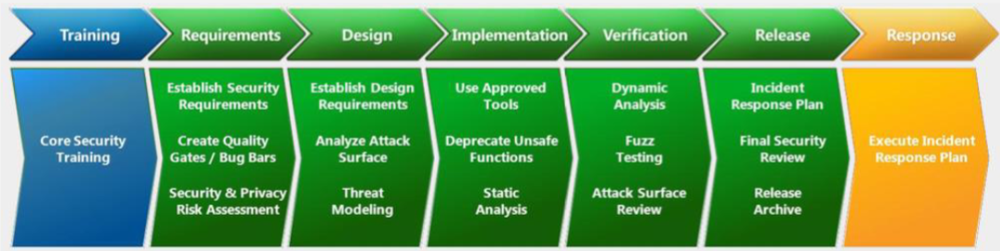

# Requisitos de seguridad

## SDL (Security Development Cycle)

Desarrollado por Microsoft

 

Se proponen 10 actividades para implementar SDL:
1. Establecer estándares de seguridad, métricas y gobernanza.
2. Uso de elementos de seguridad aprobados, lenguajes y frameworks.
3. Revisión de diseño de seguridad y modelado de amenanzas.
4. Definir y utilizar estándares de criptografía.
5. Asegure la cadena de suministro de software.
6. Asegure el entorno de ingeniería.
7. Realizar pruebas de seguridad.
8. Garantizar la seguridad de la plataforma operativa.
9. Implementar monitoreo de seguridad y respuesta.
10. Proporcionar entrenamiento de seguridad.

