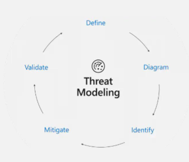
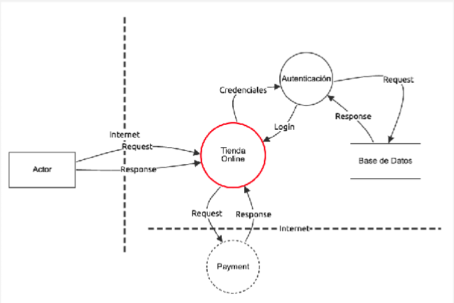
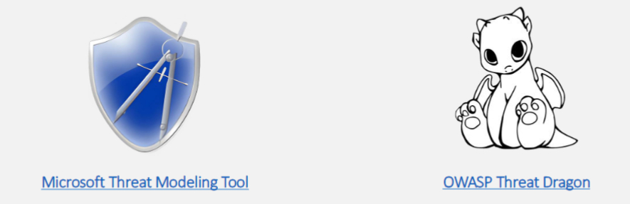
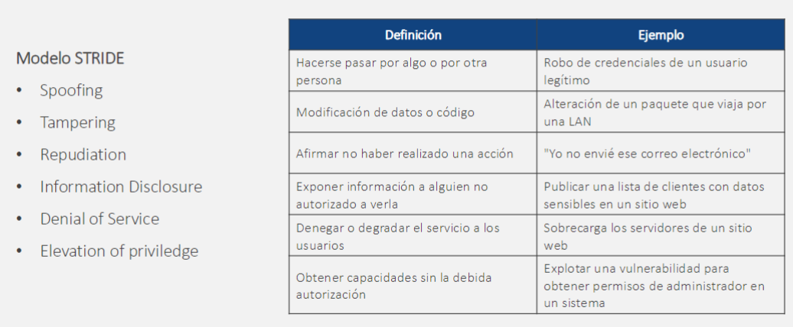
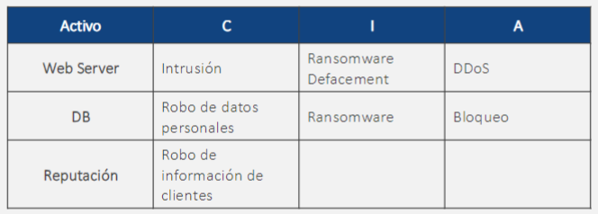
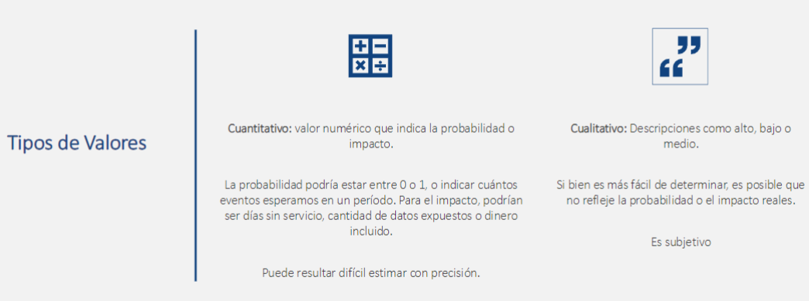
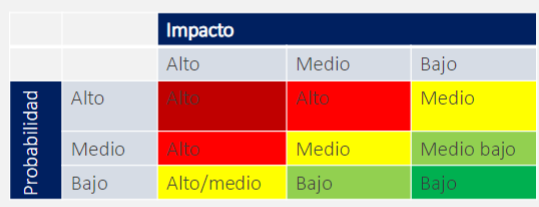

# Requisitos de seguridad

## SDL (Security Development Cycle)

Desarrollado por Microsoft

 

Se proponen 10 actividades para implementar SDL:
1. Establecer estándares de seguridad, métricas y gobernanza.
2. Uso de elementos de seguridad aprobados, lenguajes y frameworks.
3. Revisión de diseño de seguridad y modelado de amenanzas.
4. Definir y utilizar estándares de criptografía.
5. Asegure la cadena de suministro de software.
6. Asegure el entorno de ingeniería.
7. Realizar pruebas de seguridad.
8. Garantizar la seguridad de la plataforma operativa.
9. Implementar monitoreo de seguridad y respuesta.
10. Proporcionar entrenamiento de seguridad.

## Análisis de Riesgos (primera aproximación)

### Detectar activos y configuraciones
Los sistemas de información son conjuntos de componentes y sus relaciones, los cuales, nos permiten ejecutar procesos de negocios.

__Proceso clave__: adecuada gestión de activos y configuraciones.

Ejemplos:
- Aplicaciones (web, app, mobile app, web service)
- Frameworks de desarrollo (React, Angular)
- Bibliotecas de software (SoundJS, SwiperJS)
- Gestores de bases de datos (MS SQL, Mongo)
- Sistemas operativos (Windows, Linux)
- Redes de comunicaciones (protocoles, puertos)

### Identificar vulnerablididades y amenazas
Fuentes de información:
- Escaneo de vulnerabilidades (Sonarqube)
- Bases de datos de vulnerabilidades
- Fabricantes
- Fuentes especializadas

### Modelado de amenazas

 

1. Definición de activos y sus interacciones.
2. Diagrama:Procesos, actores, almacenamiento y flujo de datos
3. Por cada elemento se identifican las amenazas.

 

Herramientas:

 

#### Modelo STRIDE

 

Otros modelos comienzan por definir todos los tipos de actores, sus capacidades y qué impactos pueden tener sobre los activos.

 

### Estimar la probabilidad e impacto

 

__Impacto__: depende de los factores que decida la organización. Por ejemplo:
- __Alto__: no es posible continuar con la operación.
- __Medio__: prevalece un funcionamiento degradado.
- __Baja__: la operación puede continuar, pero con algunos problemas.

__Probabilidad__: Depende de lo fácil que sea para un atacante materializar el riesgo.
- __Alto__: Muy fácil, puede ocurrir en cualquier momento.
- __Medio__: Podría ocurrir con conocimiento especializado.
- __Baja__: Muy difícil de materializar, no ocurre normalmente.

### Estimar y evaluar el riesgo

- __Alto__: acción correctiva obligatoria.
- __Medio__: acción correctiva sugerida.
- __Bajo__: Acción correctiva deseadoa pero no necesaria/Supervisión o monitoreo.

 

